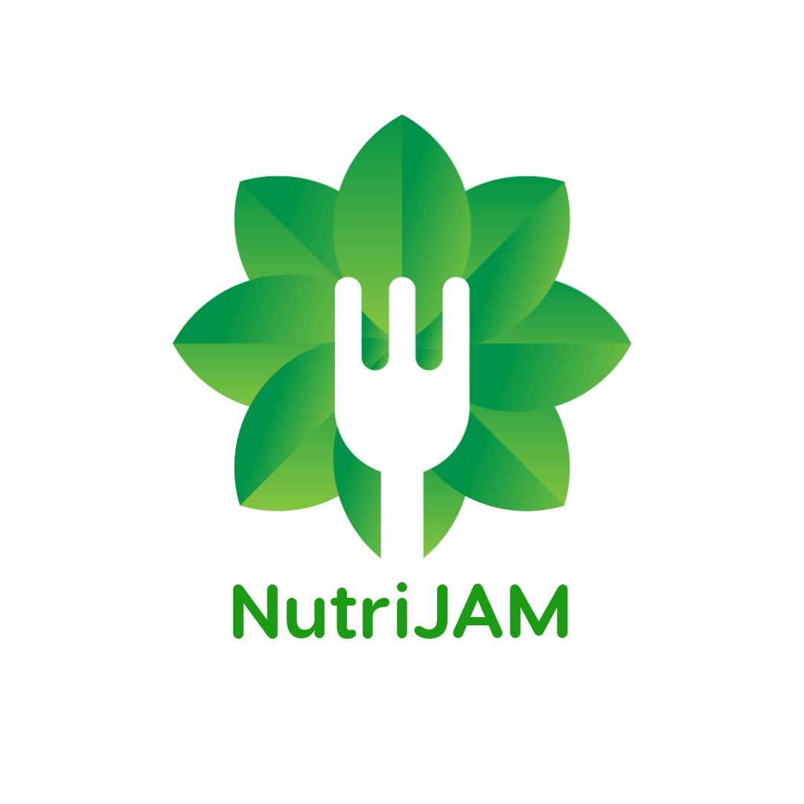

    

Everyone needs food to survive and this app will help you find fresh, new recipes. Impress your family, date, or even your pet with this must-have app!

## Website

https://nutri-jam.herokuapp.com/

## Description

A web application that allows users to search for recipes within a secure platform.

## Table of Contents

- [Built With](#built-with)
- [Installation](#installation)
- [Usage](#usage)
- [Screenshots](#screenshots)
- [Acknowledgements](#acknowledgements)
- [Questions](#questions)
- [Author](#author)

### Built-With

### Installation

Clone the repository in the CLI: `git clone https://github.com/mavila6/nutri-jam.git`. To install necessary dependencies, run the following code in the console: `npm i`.

### Usage

Run `npm run develop` in the CLI to initiate server and test out the application.

### Screenshots

### Acknowledgements

- Used [TheMealDB](https://www.themealdb.com/api.php) API.

### Questions

If you have any questions feel free to take a look at my [GitHub](https://github.com/mavila6) or contact me at mavila6@email.arizona.edu

### Authors

 [Marco Avila](https://github.com/mavila6)
 [Samantha Malone](https://github.com/smalone9) 
 [Jeremy Lentz](https://github.com/jlentz17)

&copy; 2021 CodeJAM